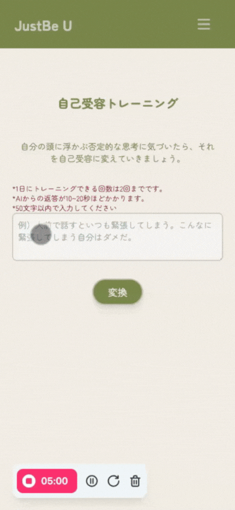
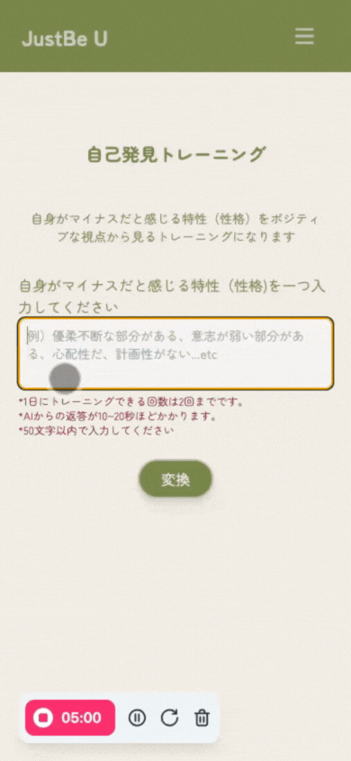
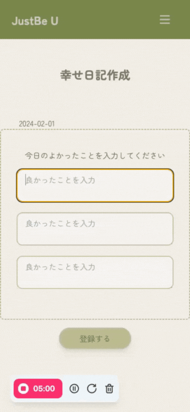
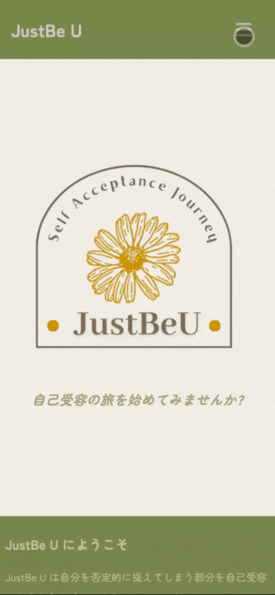
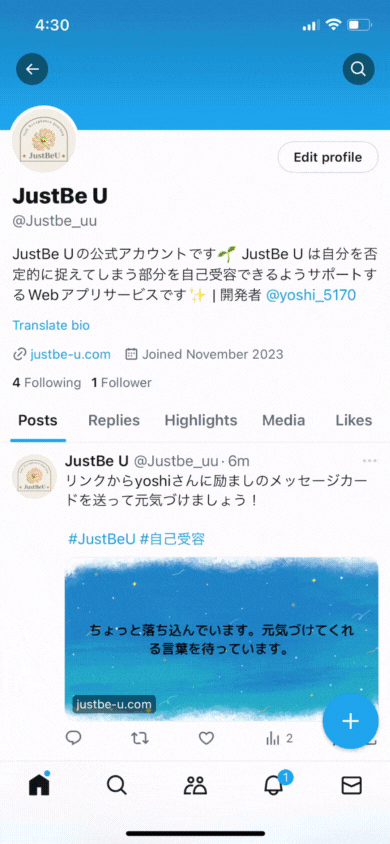
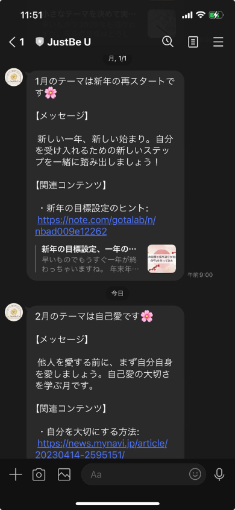

# JustBe U
  

## 【アプリのURL】
### [JustBe U](https://www.justbe-u.com/)

## サービス概要
JustBe Uは自分の性格をコンプレックスに感じたり否定してしまう人々に対し、自身の良い部分も悪い部分も全て受け入れるという自己受容の考え方に導くサポートをするサービスです。ユーザーはこのサービスを通して自己受容ができるようになり自分らしく生きるための道筋を見つけることができます。

## 想定されるユーザー層
自分の性格にコンプレックスに感じたり否定してしてしまっている人

## サービスコンセプト

**ユーザーが抱えている課題感と提供するサービスでどのように解決するのか**
課題：
自分の欠点や短所に焦点を当てすぎてしまいそれが自己否定やストレスにつながり自分自身の特性を受け入れられずにいる。

解決策：
まず、自己受容への道のりは、ユーザーが自己否定をしていることを認識することから始まると考えています。たとえば、「私はマルチタスクができないからダメな人間だ」と考えるのは自己否定です。自分の欠点を自己価値の全てとして見てしまうことで、自分を否定してしまっています。自己否定をしていることをユーザー自身が認識するために、自己否定診断機能を導入しています。この診断によって、自分がどの程度自己否定的な考え方をしているのかを知ることができます。

診断後は、AIを活用した自己受容トレーニングや自己発見トレーニング使用して自己受容するサポートをします。例えば、「私はマルチタスクができないからダメな人間だ」と入力すると、「私はマルチタスクが苦手だけれど、それが私がダメな人間だというわけではない。それは私の一部であり、他の多くの強みと共に私を形成している」というように、否定的な思考を受け入れ可能な形に変換します。
このようなステップを通じて、ユーザーは自己否定ではなく自己受容する感覚を身につけることができます。
＊自己受容とはあるがままの自分を理解し認めたうえで、全てを受け入れることです。長所・短所に関わらず評価したりはせず、無条件で受け入れます。

**このアプリを開発するに至った経緯**
内向的な性格で苦しんでいる人が自己否定ではなく自己受容することを通して、ありのままの自分が好きになれるように手助けをしたいという気持ちがあり、このサービスを作ろうと考えました。
私自身、内向的な性格の持ち主で、社会が外向性をより重視する傾向があることから、しばしば自分自身を否定していた時期がありました。自分の性格をどう変えることができるのかばかり考えていた時期があり、自分の欠点や短所が自分の価値を決めるものだと思い込んでいました。
無理に外交的に振る舞ったりしたこともありましたが逆に心身ともに疲れてしまいそれがストレスなってしまいました。
そんな時、自分の欠点や短所とどう向き合うかを考える過程で、自己否定ではなく自己受容が内向的な人々にとって重要なことだと気づきました。
自己を認めることで、内向的な人々のウェルビーイングにつながると感じました。実際、自分の内向性を受け入れ、それに満足している人は、「もっと外向的になりたい」と思っている人よりも幸せだという研究結果もあります。
しかし、自己受容とは言っても、それをどのように達成するのかがわからない、または自己否定の癖がついてしまい無意識のうちに否定的に考えてしまうことが多いと、自己受容の達成は容易ではありません。
そこで、自分みたいな内向的な人が自己受容を達成するための手助けをするサービスを作りたいと思いました。自己受容への道のりにある障壁を少しずつ取り除くことで、ユーザーの自己受容への旅をスムーズに進めることができるサービスを目指しています。

**どこが売りになるか、差別化ポイントになるか**
- 内向的な人に特化したサービス
  マインドセット系のサービスは世の中に多くありますが、内向的な人に特化したマインドセット系のサービスはあまりないのでそこがこのサービスの強みになると考えています。
  私自信が内向的な性格で悩んでいた経験があるので、内向的な性格の課題を理解しそれによりそったサービスを提供することができます。

- AIを使ったマイナスをポジティブに変換するサービスとの差別化ポイント
  - 他のAIを使ったマイナスをポジティブに変換するサービスがいくつかありますが、このサービスの特徴はユーザーが自己否定をしているかどうかを診断機能を使って認識するところから始まります。
    まずはユーザーに自信が無意識に自己否定していることを気づいてもらうことが大切だと考えています。ただ、マイナスをポジティブに変換するだけでは根本的な原因を解決することはできません。ユーザーが自分の思考のパターンや癖を理解したうえで、マイナスからポジティブに変換や自己否定脱却トレーニング機能を使ってもらうことでユーザーは単に一時的なポジティブな感情を得るだけでなく、自己受容のスキルを身につけることができます。
    また、診断結果ごとにどの機能を使うのがおすすめなのかをユーザーに提案するので、ユーザーが各機能の目的を理解し、効果的に使用することができます。

  - 自分がマイナスだと思っている特性を再評価する機能と自分のネガティブな思考を再評価する二つAI機能もこのサービスの売りのポイントです.
    特性と思考の両方から自己受容への道のりをサポートすることができます。

  - 「種から花への成長」のアニメーションでは他の類似のサービスにはない視覚的な表現方法で、ユーザーに楽しい経験を提供することができます。

## 機能
|  |  |
| --- | --- |
| **ログイン機能** | **自己否定診断**|
|    | 診断結果によってユーザーにおすすめの機能を提案|
| **自己受容トレーニング** | **自己発見トレーニング** |
|  自己否定的な思考や感情を自己受容に 向けた視点でAIが変換し自己受容する 感覚を養う| 自身がマイナスだと感じる特性を ポジティブな視点から見る トレーニング|
| **マイガーデン（スタンプ機能）** | **幸せ日記** |
|  自己受容トレーニングした回数を確認するこができ、 達成感を視覚的に楽しめる|  1日よかったことを３つ記録する機能|
| **励ましリクエスト** | **励ましメッセージ** |
|  励ましリクエストカードを作成し投稿すると 励ましメッセージを受け取ることができる。|  励ましたい相手に励ましメッセージカードを 作成し送ることができる|
| **みんなの励ましリクエスト一覧** |　**LINE通知機能**　|
|  |   毎月の１日に、その月のテーマに 沿って自己受容するためのアドバイスや 有益なリソースを通知します。|

#### その他機能
- **シェアー機能：**
  - ユーザーが内向的な性格に関する診断を受けた結果をxシェアーするこtができる
  - 励ましリクエストとかげましリクエストカードをxシェアーすることができる
- **動的OGP表示機能：**

## 主な使用技術
### バックエンド
  - Ruby on Rails
  - Ruby
  - gem
    - devise
    - ruby-openai
    - line-bot-api
    - mini_magick
    - kaminari
    - ransack
  - API
    - LINE Messaging API
    - OpenAI API
### フロントエンド
  - Tailwind CSS
  - JavaScript
### インフラ
  - Heroku
  - Amazon S3
### RDS
  - PostgreSQL
### テスティング
  - RSpec
  - Capybara
  - rubocop

## 画面遷移図
https://www.figma.com/file/Ys9dxJvhS68LH9TiSjmHnx/JustBe-U%E3%80%80%E7%94%BB%E9%9D%A2%E9%81%B7%E7%A7%BB%E5%9B%B3?type=design&node-id=0%3A1&mode=design&t=GuTUtJ987I5xmuQx-1

## ER図
